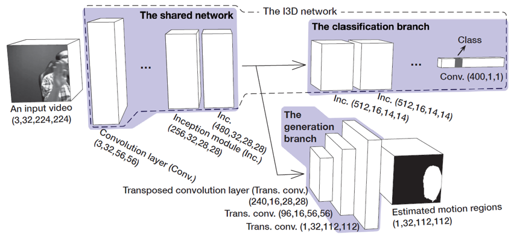

# Recognizing Gestures from Videos using a Network with Two-branch Structure and Additional Motion Cues 
## Motivation
* With development of 3D convolutional neural networks (3DCNN), research of recognizing gestures from videos by extracting spatiotemporal features  is increasing. 
* However, 3DCNN is difficult to learn long-term motion information since motion information is reduced through subsampling layers.
* Networks of learning additional motion information are required.

## Implicity incorporating multiple modalities by partially sharing network
* We propose a method that using a network with Two-branch Structure.
  * *A shared network* for implicitly incorporating multiple modalities.
  * *A generation branch* for estimating motion regions.
  * *A classification branch* for classifying gestures.

* We expect the shared network to extract features not only from the shape and motion cues but also from the *correspondence between the shape and motion cues*.

