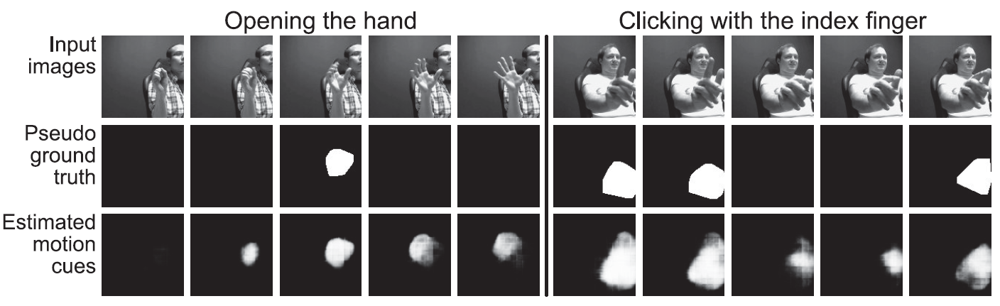

# Recognizing Gestures from Videos using a Network with Two-branch Structure and Additional Motion Cues 
## Motivation
* With development of 3D convolutional neural networks (3DCNN), research of recognizing gestures from videos by extracting spatiotemporal features  is increasing. 
* However, 3DCNN is difficult to learn long-term motion information since motion information is reduced through subsampling layers.
* Networks of learning additional motion information are required.

## Implicity incorporating multiple modalities by partially sharing network
* We propose a method that using a network with Two-branch Structure.
  * *A shared network* for implicitly incorporating multiple modalities.
  * *A generation branch* for estimating motion regions.
  * *A classification branch* for classifying gestures.
* We expect the shared network to extract features not only from the shape and motion cues but also from the *correspondence between the shape and motion cues*.
<div align=center></div>

## Binarized motion cue
* It is given as extra pixel-level supervision for learning motion in the generation branch where the network predicts a possibility of moving for each pixel.
* We expect networks can be sensitive with small motions by using it.
<div align=center></div>

## Experimental results
* The proposed networks with implicitly fused binarized motion cues obtained the best performance, which showed they can extract more discriminable features for recognition.
* However, the improvement of accuracies by using pre-trained parameters on the classification branch exceeds that by adding a generation branch without using pre-trained parameters.
<div align=center></div>

* The networks detected small motion which was not provided in pseudo ground truth.
* Rather than optical flow cues, the networks with fused binarized motion cues were more sensitive with small motions. 
<div align=center></div>

## Citation
FG 2020 [paper](https://www.computer.org/csdl/proceedings-article/fg/2020/307900a040/1kecHQBZxAs)
```
@inproceedings{zhou2020recognizing,
  title={Recognizing Gestures from Videos using a Network with Two-branch Structure and Additional Motion Cues},
  author={Zhou, Jiaxin and Komuro, Takashi},
  booktitle={2020 15th IEEE International Conference on Automatic Face and Gesture Recognition (FG 2020)},
  pages={133--137},
  year={2020},
  organization={IEEE}
}
```

## Reference
- piergiaj/pytorch-i3d [repo](https://github.com/piergiaj/pytorch-i3d/blob/master/pytorch_i3d.py)

